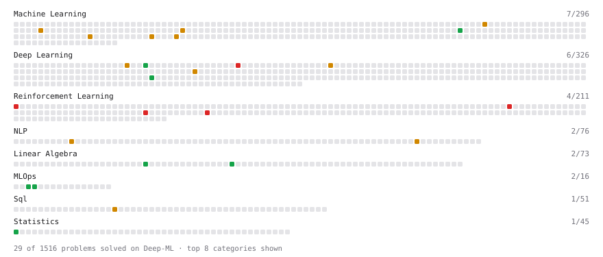

# Deep-ML

My machine learning practice from [Deep-ML](https://www.deep-ml.com). Every solution here was written by hand.

**42** solved · 42 problems · 0 labs · 0 math

[**Browse the interactive portfolio**](https://Shubhanflash22.github.io/deep-ml/) to replay this filling in over time.

## Problems

| | Difficulty | Solved | |
| --- | --- | --- | --- |
| [Calculate Batch Prediction Health Metrics](https://www.deep-ml.com/problems/249) | easy | 2026-08-20 | [solution](problems/0249-calculate-batch-prediction-health-metrics) |
| [Calculate Covariance Matrix](https://www.deep-ml.com/problems/10) | easy | 2026-08-15 | [solution](problems/0010-calculate-covariance-matrix) |
| [Calculate Portfolio Variance](https://www.deep-ml.com/problems/183) | easy | 2026-07-29 | [solution](problems/0183-calculate-portfolio-variance) |
| [Calculate SLA Compliance Metrics for Model Service](https://www.deep-ml.com/problems/250) | easy | 2026-08-19 | [solution](problems/0250-calculate-sla-compliance-metrics-for-model-service) |
| [Construct Causal Attention Mask via tril and triu Methods](https://www.deep-ml.com/problems/965) | easy | 2026-08-27 | [solution](problems/0965-construct-causal-attention-mask-via-tril-and-triu-methods) |
| [Convert RGB Image to Grayscale](https://www.deep-ml.com/problems/237) | easy | 2026-08-16 | [solution](problems/0237-convert-rgb-image-to-grayscale) |
| [Embedding Layer as One-Hot Matrix Multiplication](https://www.deep-ml.com/problems/947) | easy | 2026-08-01 | [solution](problems/0947-embedding-layer-as-one-hot-matrix-multiplication) |
| [Implement Compressed Row Sparse Matrix (CSR) Format Conversion](https://www.deep-ml.com/problems/65) | easy | 2026-08-13 | [solution](problems/0065-implement-compressed-row-sparse-matrix-csr-format-conversion) |
| [Implement the ELU Activation Function](https://www.deep-ml.com/problems/97) | easy | 2026-08-22 | [solution](problems/0097-implement-the-elu-activation-function) |
| [Matrix-Vector Dot Product](https://www.deep-ml.com/problems/1) | easy | 2026-09-01 | [solution](problems/0001-matrix-vector-dot-product) |
| [Mode-Dependent Context Window Evaluation](https://www.deep-ml.com/problems/762) | easy | 2026-08-02 | [solution](problems/0762-mode-dependent-context-window-evaluation) |
| [Per-Token Decode Latency from Memory Bandwidth](https://www.deep-ml.com/problems/1214) | easy | 2026-08-21 | [solution](problems/1214-per-token-decode-latency-from-memory-bandwidth) |
| [Reshape and Transpose a Tinygrad Tensor](https://www.deep-ml.com/problems/890) | easy | 2026-08-12 | [solution](problems/0890-reshape-and-transpose-a-tinygrad-tensor) |
| [Row-Normalize a Count Matrix to Probabilities](https://www.deep-ml.com/problems/985) | easy | 2026-09-03 | [solution](problems/0985-row-normalize-a-count-matrix-to-probabilities) |
| [Vector Norms (L1/L2/L-inf) and the Frobenius Norm](https://www.deep-ml.com/problems/328) | easy | 2026-08-04 | [solution](problems/0328-vector-norms-l1-l2-l-inf-and-the-frobenius-norm) |
| [Bradley-Terry Model for Pairwise Rankings](https://www.deep-ml.com/problems/322) | medium | 2026-08-14 | [solution](problems/0322-bradley-terry-model-for-pairwise-rankings) |
| [Data-Efficient Action Mapping with Few Labeled Expert Samples](https://www.deep-ml.com/problems/728) | medium | 2026-08-31 | [solution](problems/0728-data-efficient-action-mapping-with-few-labeled-expert-samples) |
| [Decision Tree Pruning with Cost-Complexity](https://www.deep-ml.com/problems/285) | medium | 2026-08-07 | [solution](problems/0285-decision-tree-pruning-with-cost-complexity) |
| [Highest Total Daily Order Cost in a Date Range](https://www.deep-ml.com/problems/1120) | medium | 2026-08-24 | [solution](problems/1120-highest-total-daily-order-cost-in-a-date-range) |
| [Implement Position-wise Feed-Forward Block with Residual and Dropout](https://www.deep-ml.com/problems/178) | medium | 2026-07-30 | [solution](problems/0178-implement-position-wise-feed-forward-block-with-residual-and-dropout) |
| [Implement Self-Attention Mechanism](https://www.deep-ml.com/problems/53) | medium | 2026-09-04 | [solution](problems/0053-implement-self-attention-mechanism) |
| [Incremental PCA with Partial Fit](https://www.deep-ml.com/problems/820) | medium | 2026-08-03 | [solution](problems/0820-incremental-pca-with-partial-fit) |
| [Local Outlier Factor (LOF) Anomaly Score](https://www.deep-ml.com/problems/830) | medium | 2026-08-10 | [solution](problems/0830-local-outlier-factor-lof-anomaly-score) |
| [Mask Instruction Tokens for Loss Computation](https://www.deep-ml.com/problems/1066) | medium | 2026-08-17 | [solution](problems/1066-mask-instruction-tokens-for-loss-computation) |
| [Micro F1 Score for Multi-Label Classification](https://www.deep-ml.com/problems/834) | medium | 2026-07-26 | [solution](problems/0834-micro-f1-score-for-multi-label-classification) |
| [Negative Binomial Distribution Probability](https://www.deep-ml.com/problems/247) | medium | 2026-08-28 | [solution](problems/0247-negative-binomial-distribution-probability) |
| [Numerical Gradient Checking](https://www.deep-ml.com/problems/313) | medium | 2026-08-30 | [solution](problems/0313-numerical-gradient-checking) |
| [Numerically Stable Cross-Entropy](https://www.deep-ml.com/problems/914) | medium | 2026-08-29 | [solution](problems/0914-numerically-stable-cross-entropy) |
| [QK-Norm (Query-Key Normalization)](https://www.deep-ml.com/problems/407) | medium | 2026-07-26 | [solution](problems/0407-qk-norm-query-key-normalization) |
| [Speculative Decoding Acceptance Rate vs Temperature](https://www.deep-ml.com/problems/433) | medium | 2026-07-27 | [solution](problems/0433-speculative-decoding-acceptance-rate-vs-temperature) |
| [Temperature Decay Scheduler](https://www.deep-ml.com/problems/231) | medium | 2026-08-26 | [solution](problems/0231-temperature-decay-scheduler) |
| [The Pattern Weaver's Code](https://www.deep-ml.com/problems/89) | medium | 2026-07-31 | [solution](problems/0089-the-pattern-weaver-s-code) |
| [Thread-Safe Producer-Consumer Bounded Buffer](https://www.deep-ml.com/problems/1100) | medium | 2026-09-02 | [solution](problems/1100-thread-safe-producer-consumer-bounded-buffer) |
| [Tree and Graph Coding Drills](https://www.deep-ml.com/problems/1090) | medium | 2026-08-25 | [solution](problems/1090-tree-and-graph-coding-drills) |
| [Values Appearing Three or More Times Consecutively](https://www.deep-ml.com/problems/1117) | medium | 2026-08-09 | [solution](problems/1117-values-appearing-three-or-more-times-consecutively) |
| [XGBoost Objective Function Calculation](https://www.deep-ml.com/problems/347) | medium | 2026-08-05 | [solution](problems/0347-xgboost-objective-function-calculation) |
| [Differential Sarsa Algorithm](https://www.deep-ml.com/problems/541) | hard | 2026-08-18 | [solution](problems/0541-differential-sarsa-algorithm) |
| [Implement a Simple CNN Training Function with Backpropagation](https://www.deep-ml.com/problems/130) | hard | 2026-08-06 | [solution](problems/0130-implement-a-simple-cnn-training-function-with-backpropagation) |
| [Implement Gated DeltaNet Linear Attention](https://www.deep-ml.com/problems/1017) | hard | 2026-08-23 | [solution](problems/1017-implement-gated-deltanet-linear-attention) |
| [Implement the GRPO Objective Function](https://www.deep-ml.com/problems/101) | hard | 2026-08-08 | [solution](problems/0101-implement-the-grpo-objective-function) |
| [Residual Gradient Algorithm for Value Function Approximation](https://www.deep-ml.com/problems/577) | hard | 2026-07-28 | [solution](problems/0577-residual-gradient-algorithm-for-value-function-approximation) |
| [Temporal Abstraction with Options](https://www.deep-ml.com/problems/587) | hard | 2026-08-11 | [solution](problems/0587-temporal-abstraction-with-options) |

---

_This file is regenerated by Deep-ML on every push._
